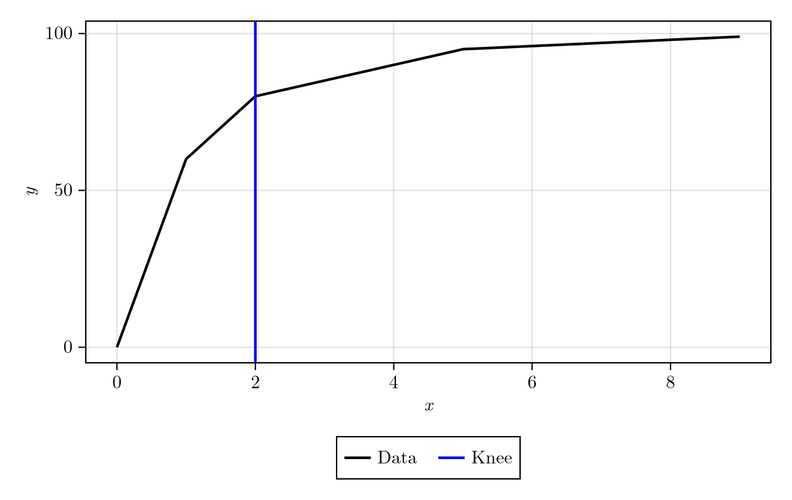

# Kneedle.jl

This is a [Julia](https://julialang.org/) implementation of the Kneedle[^1] knee-finding algorithm. This detects "corners" (or "knees", "elbows", ...) in a dataset `(x, y)`.

# Features

- Exports one main function `kneedle` with the ability to select the shape and number of knees to search for.
- Built-in data smoothing from [Loess.jl](https://github.com/JuliaStats/Loess.jl).
- [Makie](https://docs.makie.org/stable/) extension for quick visualization.

# Installation

- coming soon

# Quick Start

Find a knee automatically using `kneedle(x, y)`:

```julia
using Kneedle
x, y = Testers.CONCAVE_INC
kr = kneedle(x, y) # kr is a `KneedleResult`
knees(kr) # [2], therefore a knee is detected at x = 2
```

In order to use the plotting functionality, a Makie backend is required. For this example, this amounts to including the line `import CairoMakie`. This provides access to the function `viz(x, y, kr; kwargs...)`:

```julia
import CairoMakie
viz(x, y, kr, show_data_smoothed = false) # we didn't use any smoothing here, so no need to show it
```

[](https://70gage70.github.io/Kneedle.jl/)

# Advanced Usage

The main function `kneedle` is documented here as well as the plotting convenience function `viz`. See `Kneedle.Testers` for ready-made test data sets.

---


    kneedle(args...)
    
There are several methods for the `kneedle` function as detailed below; each returns a `KneedleResult`. 

Use `knees(kr::KneedleResult)` to obtain the computed knees/elbows as a list of `x` coordinates.

Refer to `viz` for visualization.

Each `kneedle` function contains the args `x` and `y` which refer to the input data. It is required that `x` is sorted.

Each `kneedle` function contains the kwargs `S` and `smoothing`. `S > 0` refers to the sensitivity of the knee/elbow detection algorithm in the sense that higher `S` results in fewer detections. `smoothing` refers to the amount of smoothing via interpolation that is applied to the data before knee detection. If `smoothing == nothing`, it will be bypassed entirely. If `smoothing ∈ [0, 1]`, this parameter is passed directly to [Loess.jl](https://github.com/JuliaStats/Loess.jl) via its `span` parameter. Generally, higher `smoothing` results in less detection.

## Shapes

There are four possible knee/elbow shapes in consideration. If a `kneedle` function takes `shape` as an argument, it \
should be one of these.

- concave increasing: `|¯` or `"concave_inc"`
- convex decreasing: `|_` or `"convex_dec"`
- concave decreasing: `¯|` or `"concave_dec"`
- convex increasing: `_|` or `"convex_inc"`

Note that the symbol `¯` is entered by typing `\highminus<TAB>`

## Methods

### Fully automated kneedle

    kneedle(x, y; S = 1.0, smoothing = nothing, verbose = false)

This function attempts to determine the shape of the knee automatically. Toggle `verbose` to get a printout of the guessed shape.

### Kneedle with a specific shape

    kneedle(x, y, shape; S = 1.0, smoothing = nothing)

This function finds knees/elbows with the given `shape`.

### Kneedle with a specific shape and number of knees

    kneedle(x, y, shape, n_knees; scan_type = :S, S = 1.0, smoothing = nothing)

This function finds exactly `n_knees` knees/elbows with the given `shape`.

This works by bisecting either `S` (if `scan_type == :S`) or `smoothing` (if `scan_type == :smoothing`).

## Examples

Find a knee:

```julia-repl
julia> x, y = Testers.CONCAVE_INC
julia> kr1 = kneedle(x, y)
julia> knees(kr1) # 2, meaning that there is a knee at `x = 2`
```

Find a knee with a specific shape:

```julia-repl
julia> kr2 = kneedle(x, y, "concave_inc")
julia> knees(kr1) == knees(kr2) # true
```

Use the pictoral arguments:

```julia-repl
julia> kr3 = kneedle(x, y, "|¯")
julia> knees(kr3) == knees(kr1) # true
```

Find a given number of knees:

```julia-repl
julia> x, y = Testers.double_bump(noise_level = 0.3)
julia> kr4 = kneedle(x, y, "|¯", 2)
julia> length(knees(kr4)) # 2, meaning that the algorithm found 2 knees
```

---

    viz(x, y, kneedle_result; show_data = true, show_data_smoothed = true, show_knees = true, linewidth = 2.0)

Visualize the computed knees in `kneedle_result` from data `x`, `y`. Optionally show various elements based on keyword arguments and set the line width.

This function requires a Makie backend to function, e.g. `import CairoMakie`.

# See also

- [kneed](https://github.com/arvkevi/kneed): Knee-finding in Python.

- [Yellowbrick](https://www.scikit-yb.org/en/latest/api/cluster/elbow.html?highlight=knee): Machine learning visualization.

# References

[^1]: Satopaa, Ville, et al. *Finding a "kneedle" in a haystack: Detecting knee points in system behavior.* 2011 31st international conference on distributed computing systems workshops. IEEE, 2011.